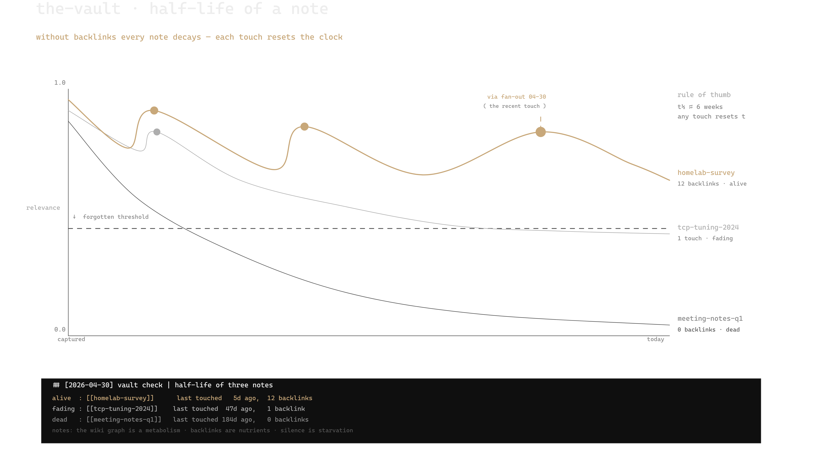

# skills

A small set of Claude Code skills I use day-to-day. Each one does a single thing and stays out of the way — pick what you need, ignore the rest.



> Generated end-to-end by the [`excalidraw`](skills/excalidraw) skill.

## Skills

- **[afk](skills/afk)** — posture for unattended autonomous work: no clarifying questions, low-blast default, audit log to `~/.claude/afk-logs/`. Invoke with `/afk` when handing off an overnight run, audit, or any session you won't supervise.
- **[excalidraw](skills/excalidraw)** — generates `.excalidraw` diagrams that argue visually, not just label boxes. Use when a diagram needs to teach something, not decorate a slide.
- **[handoff](skills/handoff)** — compacts the current session into a handoff file plus a paste-ready snippet. Use when switching machine, hitting a context limit, or briefing another agent.
- **[homelab-companion](skills/homelab-companion)** — fail-mode forensics for homelab debugging and post-mortems. Use after something broke and you want a structured RCA instead of a guessing game.
- **[max-effort](skills/max-effort)** — posture for high-stakes / irreversible work: dispatches subagents widely, then runs an orchestrator-pass that's the load-bearing verification step. Invoke with `/max-effort` (single-task) or `/max-effort sustained` (session).
- **[verify-claims](skills/verify-claims)** — audits factual claims in prose for traceable sources and returns a classified table. Use when you want to fact-check Claude's own output or a document — distinct from `/verify`, which runs the app to confirm code behavior.

Each skill has its own README with details, install notes, and usage examples.

## Install

Install the whole bundle as a plugin:

```bash
/plugin install ikkeseb/skills
```

Or clone and symlink individual skills:

```bash
git clone https://github.com/ikkeseb/skills ~/skills
ln -s ~/skills/skills/<name> ~/.claude/skills/<name>
```

## License

MIT — see [LICENSE](LICENSE).
