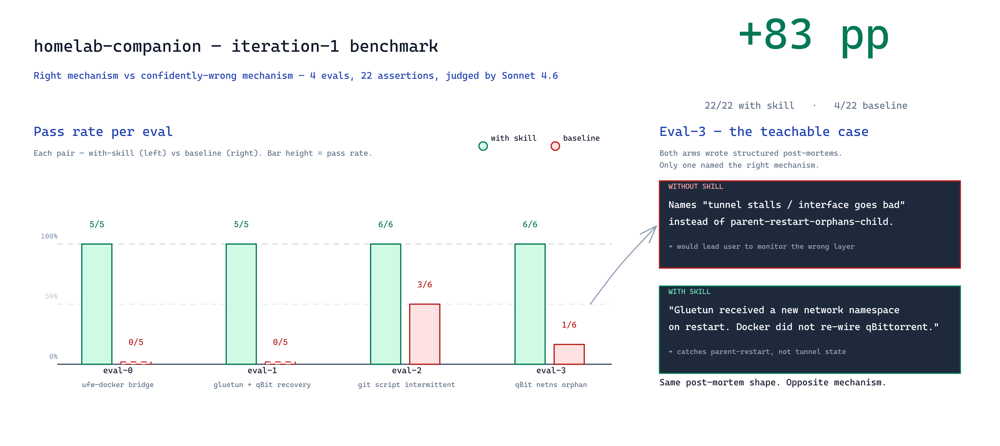

# homelab-companion

A Claude Code skill that gives the model a **fail-mode forensics
framework** for homelab and self-host operations. Four reasoning
principles catch common LLM failure modes during debugging; a
catalog of pitfalls illustrates the framework applied to
specific cases.

Two operating modes:

- **Retrospective** — structures incident analysis when
  something already broke. Drives a phase-by-phase post-mortem,
  applies the framework during root-cause hypothesis, and
  outputs an editable Markdown draft against a standard
  template. Auto-triggers on RCA-shaped requests
  ("post-mortem", "what went wrong", "RCA").
- **Preventive** — applies the framework to a config the user
  is about to deploy. Manual invocation only; the user
  explicitly asks for a review. Does not auto-trigger on
  routine homelab edits.

## The framework

Four principles, full treatment in
[`references/framework/INDEX.md`](references/framework/INDEX.md):

1. **[Data layer over surface layer](references/framework/01-data-vs-surface.md)**
   — `docker ps` / `ufw status` / schema validators project
   summaries that can disagree with the underlying data. When
   diagnosis stalls, drop one layer.
2. **[Ordering, not arg-tuning](references/framework/02-ordering-vs-args.md)**
   — many intermittent failures are structural. Reorder calls;
   don't tune flags.
3. **[Read-only before mutation](references/framework/03-readonly-first.md)**
   — many "diagnostic" commands contain a hidden mutation that
   destroys evidence. Prove the next command doesn't write
   before running it.
4. **[Name the default before answering](references/framework/04-debias-prompt.md)**
   — name the plausible-but-wrong default reach before
   answering, so principles 1–3 become inspectable.

The framework gives a useful answer even when no catalog
pitfall matches the symptom. The pitfalls are **worked
examples of the framework**, not the primary content.

## Who is this for

Anyone running a Docker / Linux homelab who uses Claude Code as
a working assistant. The scope assumes industry-baseline tooling
(Docker, systemd, ufw, gluetun, the arr-stack, Home Assistant,
git) but doesn't insist on any specific topology, NAS, or
distribution.

## Install

Drop the repo into your Claude Code skills directory:

```bash
git clone https://github.com/ikkeseb/homelab-companion.git \
    ~/.claude/skills/homelab-companion
```

Or symlink if you prefer to keep the repo elsewhere:

```bash
ln -s "$(pwd)" ~/.claude/skills/homelab-companion
```

The skill loads automatically on the next Claude Code session.
Confirm it's available with `/skills` — `homelab-companion`
should appear in the list.

## Quickstart

### Retrospective mode (auto-triggered)

Ask for a post-mortem after something broke and the skill
activates automatically:

> qBittorrent went unreachable after the gluetun restart last
> night — write up what happened.

> We had a Sonarr import failure this morning. Help me
> structure the post-mortem.

> RCA on yesterday's deploy?

The skill drives the phase-by-phase prompts in
[`references/postmortem-prompts.md`](references/postmortem-prompts.md),
applies the four framework principles during root-cause
hypothesis, optionally pulls logs via
[`scripts/gather-logs.sh`](scripts/gather-logs.sh), and fills
[`references/postmortem-template.md`](references/postmortem-template.md)
section by section. Output is an editable Markdown draft, not a
polished final document.

### Preventive mode (manual)

Explicitly invoke the skill or ask Claude Code for a config
review:

> Use the homelab-companion skill — review this compose file
> before I deploy it.

> I'm setting up gluetun + qBittorrent — run the framework
> against my config and flag anything that fires.

> Should I use `network_mode: host` for this CI runner?
> (Apply the homelab-companion forensics framework.)

The skill walks the four principles against your config, loads
matching pitfall(s) from
[`references/pitfalls/INDEX.md`](references/pitfalls/INDEX.md)
when one applies, and recommends the structural fix shape. If
nothing in the framework or catalog fires, the skill says so
and stays out of your way.

### Why not auto-trigger preventive mode?

Auto-triggering on every homelab-adjacent question over-fires
on routine edits and bloats responses. Most users have
project-level CLAUDE.md files that already cover preventive
guidance for their specific setup; this skill complements that
by being available on demand for the deeper framework pass.
Retrospective mode auto-triggers because PM structure is rarely
duplicated in project-level docs.

## How well does it work

**v0.1 benchmark** — 4 evals, ~5 runs each, 22 assertions
total: **22/22 passes with skill vs 4/22 baseline (+83 pp)**.



The most teachable case is eval-3. Both arms produced
structurally-recognizable post-mortems, but only the with-skill
arm named the actual mechanism (parent-restart-orphans-child).
The baseline confidently named the wrong one (tunnel stall /
interface goes bad) — exactly the failure shape the catalog
targets.

Cost: with-skill mode runs ~52% more tokens and ~37% more
wall-clock vs baseline, driven by progressive-disclosure file
loads.

**Note:** the v0.1 benchmark predates the v0.2 framework
refactor. v0.2 promotes the four reasoning principles to
first-class content (previously buried as cluster notes in
`pitfalls/INDEX.md`) and narrows the skill's auto-trigger to
retrospective mode only. Re-benchmarking against v0.2 is open
work; expect the framework expansion to help most on novel
symptoms the catalog doesn't directly cover.

## What's in v0.2

**Forensics framework** ([`references/framework/`](references/framework/INDEX.md))
— four reasoning principles that fire across all domains:

1. [Data layer over surface layer](references/framework/01-data-vs-surface.md)
2. [Ordering, not arg-tuning](references/framework/02-ordering-vs-args.md)
3. [Read-only before mutation](references/framework/03-readonly-first.md)
4. [Name the default before answering](references/framework/04-debias-prompt.md)

**Pitfall catalog** — six worked examples of the framework
applied to specific homelab failure modes:

| Domain | Pitfall | Principles |
|---|---|---|
| Networking / firewall | [ufw drops Docker bridge-to-host traffic](references/pitfalls/ufw-docker-bridge-drop.md) | 1, 4 |
| Docker / containers | [`network_mode` parent restart orphans the child's netns](references/pitfalls/network-mode-netns-orphan.md) | 1 |
| Media / arr-stack | [Scene-RAR vs flat-MKV release layouts in arr-stack imports](references/pitfalls/arr-stack-scene-imports.md) | 1, 2 |
| Git / sync | [Sync before write in shared-write git repos](references/pitfalls/sync-before-write.md) | 2, 4 |
| YAML / config | [YAML 1.1 boolean keyword trap](references/pitfalls/yaml-boolean-trap.md) | 1 |
| Meta / diagnostic | [Mutative-vs-readonly diagnostics](references/pitfalls/mutative-vs-readonly-diagnostics.md) | 2, 3 |

**Plus:**

- An incident-shape PM template and phase-by-phase prompts (PM
  Phase 2 explicitly walks the four framework principles).
- Two anonymized worked examples in
  [`references/examples/`](references/examples/) showing the
  shape of a finished post-mortem.
- Two helper scripts:
  - [`scripts/gather-logs.sh`](scripts/gather-logs.sh) —
    bundle `journalctl` + `docker logs` + `systemctl status`
    for one service into one labeled stdout dump. `--max-lines`
    cap (default 500) protects Claude's context window from
    verbose services.
  - [`scripts/check-ufw-docker.sh`](scripts/check-ufw-docker.sh)
    — diagnose the ufw-docker bridge-drop pitfall against your
    actual ufw rules and Docker bridge subnets.

## Example walkthrough — preventive mode (manual invocation)

A user explicitly asks Claude Code to apply the framework
before deploying a CI runner that needs to clone from a Forgejo
instance running on the same host:

> User: Use the homelab-companion skill to review this. Setting
> up a new CI runner in Docker that needs to ssh to the Forgejo
> bastion on the LAN. Compose looks fine?
> ```yaml
> services:
>   ci-runner:
>     image: forgejo/runner:6
>     restart: unless-stopped
>     environment:
>       FORGEJO_URL: https://forge.lan/
> ```

> Claude Code: Running the framework against this. **Principle
> 1 (data layer)** fires: the runner will be on a Docker bridge
> subnet (typically `172.x.x.x`), and your host's ufw default-
> deny will drop the runner's SSH attempts to the host's LAN
> IP. The surface "ufw rules look right for SSH" hides the data
> layer "the source IP isn't on the LAN, it's on the bridge
> subnet". This matches the **ufw-docker bridge-drop** pitfall
> exactly.
>
> **Principle 4 (named default):** the reflexive answer here is
> *"open the port with `ufw allow 22`"* — that's a port-keyed
> rule, but the failure is source-subnet-keyed. The structural
> fix is to allow the source subnet, or move to `network_mode:
> host`. See
> [`references/pitfalls/ufw-docker-bridge-drop.md`](references/pitfalls/ufw-docker-bridge-drop.md)
> for the three fix shapes and trade-offs.

## Example walkthrough — retrospective mode

A user reports a failed scheduled job:

> User: My nightly backup script failed at 02:00. Help me
> write this up.

> Claude Code: Quick scope before we write this up:
> - What service or stack broke?
> - When did it start, when fixed?
> - User-visible failure?
> - First-noticed via alert or manual?
>
> Want me to run `scripts/gather-logs.sh backup --since 6h` to
> pull a log bundle?

The user answers. Claude Code fills the PM template section by
section through the phases — symptom intake, root-cause
hypothesis (run through the four framework principles and
cross-checked against the pitfall catalog), fix, recovery,
verification, open follow-ups — and hands back an editable
draft.

## Contributing pitfalls

A new pitfall is worth adding when **all three** of these hold:

1. **Symptom is easy to misdiagnose at first glance.** The
   surface presentation points the user away from the actual
   cause.
2. **Root cause is non-obvious.** Requires understanding of an
   underlying mechanism the user wouldn't naturally inspect.
3. **An LLM with no context plausibly gives a wrong answer.**
   This is the differentiator. If models reliably get it right
   without help, the entry adds no signal.

A pitfall should also be classifiable against the framework —
which of the four principles does it illustrate? If it
genuinely doesn't fit any, that's a candidate for a fifth
framework principle, not a new pitfall. Surface that on the
issue.

To propose one:

1. Open an issue describing the symptom, root cause, and the
   AI default trap. Include a pointer to a real incident if
   possible.
2. Once the shape is agreed, submit a PR adding
   `references/pitfalls/<slug>.md` following the existing
   template:
   - `## Symptom`
   - `## Root cause` (with `### Diagnosis` sub-section if
     concrete commands help)
   - `## Fix`
   - `## Why LLMs miss this` — original work per entry. The
     plausible-but-wrong default answer, named explicitly, plus
     a redirect prompt that routes models to the correct
     framing.
   - `## See also`
3. Update
   [`references/pitfalls/INDEX.md`](references/pitfalls/INDEX.md)
   with the new row.

The "Why LLMs miss this" section is mandatory and is where the
catalog gets its differentiating value. Don't skip it. Don't
restate the symptom in different words — name the trap.

## Staleness expectations

Tooling versions and conventions change. Each pitfall captures a
real failure mode at the time the entry was written; behavior
may evolve. If a pitfall's diagnostic commands or fix shape no
longer match current behavior, file an issue or PR with the
update.

## License

MIT. See [LICENSE](LICENSE).
