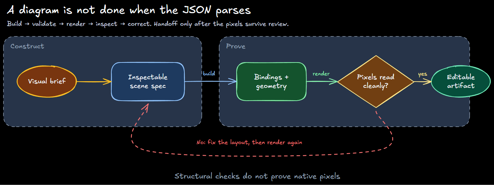

# Excalidraw diagram skill

Generate native, editable `.excalidraw` diagrams through an inspectable scene
specification, structural validation, lightweight layout diagnostics, and
native visual review. The same Node workflow runs in Claude Code and Codex.

The visual-argument principles evolved from
[coleam00/excalidraw-diagram-skill](https://github.com/coleam00/excalidraw-diagram-skill);
the builder and verification pipeline are maintained here.



> Generated by the bundled builder. Sources:
> [`visual-review-loop.scene.json`](examples/visual-review-loop.scene.json) and
> [`visual-review-loop.excalidraw`](examples/visual-review-loop.excalidraw).
> The image is an official Excalidraw 0.18.1 render, not the lightweight
> layout diagnostic.

## Install

The skill ships in the
[`ikkeseb-skills`](https://github.com/ikkeseb/skills) plugin bundle.

Claude Code:

```bash
/plugin marketplace add ikkeseb/skills
/plugin install ikkeseb-skills@ikkeseb
```

Codex:

```bash
codex plugin marketplace add ikkeseb/skills
codex plugin add ikkeseb-skills@ikkeseb
```

The only runtime requirement is Node.js 18 or newer. Structural validation and
layout SVG have no external dependencies or network calls. A locally installed
Chrome, Chromium, or Edge can also rasterize the layout diagnostic. The skill
checks an explicit `EXCALIDRAW_BROWSER_PATH`, per-user and system Windows
installs, and common browser names on `PATH`. It does not install or bundle a
browser or a heavyweight Excalidraw runtime.

## Use

Invoke `/excalidraw` in Claude Code or choose `$excalidraw` in Codex, then ask
for the relationship or system you want explained:

> Create an Excalidraw diagram of an OAuth 2.0 authorization code flow.

> Show where visual verification can fail in our artifact pipeline.

The skill defaults to Excalifont on a black canvas. It writes a compact
`.scene.json`, builds native Excalidraw JSON, checks bindings and geometry, and
creates an early layout diagnostic. It then imports the native file into an
available official Excalidraw surface and inspects those pixels before
delivery.

For manual use from this directory:

```bash
node scripts/excalidraw.mjs build examples/visual-review-loop.scene.json
node scripts/excalidraw.mjs check examples/visual-review-loop.excalidraw examples/visual-review-loop.layout.png
```

`check` exits `2` after the layout diagnostic because it has not rendered the
native artifact. Open the final file with **File → Open** in an official
Excalidraw app or [excalidraw.com](https://excalidraw.com), zoom to fit, and
inspect that canvas. Ask before loading sensitive diagrams into the website.
Do not paste whole-scene JSON into an existing canvas; paste merges with
cached content.

Methodology lives in [`SKILL.md`](SKILL.md), the compact input format in
[`references/scene-spec.md`](references/scene-spec.md), semantic color usage in
[`references/color-palette.md`](references/color-palette.md), and the exact
runtime tokens in [`references/palette.json`](references/palette.json).
